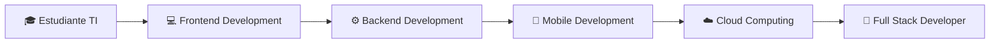

<h1 align="center">¡Hola! Soy Ángel 👨🏻‍💻</h1>
¡Hola! Soy Angel Guerra Muñoz, un estudiante de Tecnologías de la Información con enfoque en Desarrollo de Software Multiplataforma. Me apasiona la programación y estoy constantemente aprendiendo y explorando nuevas tecnologías para mejorar mis habilidades.

<h2 align="center">🚀 Acerca de mí:</h2>

    🔭 Estudiante Universitario 
    🌱 Actualmente estoy aprendiendo Desarrollo de Software 
    💼 Interesado en oportunidades laborales en el campo de la tecnología 
    🌍 Me encanta aprender sobre nuevas tecnologías y tendencias 
    🎮 En mi tiempo libre, disfruto de los videojuegos 

## Contacto
- Correo electrónico Personal: ag9190833@gmail.com
- Github: GUERRA-ANGEL

### 🚀 **Lenguajes de Programación**

### 🎨 **Frontend Development**

### ⚙️ **Backend Development**

### 📱 **Mobile Development**

### 🗄️ **Bases de Datos**

### ☁️ **Cloud & DevOps**

### 🛠️ **Herramientas & IDEs**

##  **Mi Trayectoria de Aprendizaje**

## Idiomas
 Inglés B1

##  **Habilidades Blandas**

| 🧠 **Técnicas** | 🤝 **Interpersonales** | 🎯 **Profesionales** |
|:---------------:|:---------------------:|:-------------------:|
| Resolución de problemas | Trabajo en equipo | Autodidacta |
| Pensamiento lógico | Comunicación efectiva | Gestión del tiempo |
| Creatividad | Liderazgo | Adaptabilidad |
| Análisis crítico | Empatía | Orientación a resultados |

<picture>
  <source media="(prefers-color-scheme: dark)" srcset="https://raw.githubusercontent.com/platane/platane/output/github-contribution-grid-snake-dark.svg">
  <source media="(prefers-color-scheme: light)" srcset="https://raw.githubusercontent.com/platane/platane/output/github-contribution-grid-snake.svg">
  
</picture>

<!--
**GUERRA-ANGEL/GUERRA-ANGEL** is a ✨ _special_ ✨ repository because its `README.md` (this file) appears on your GitHub profile.

Here are some ideas to get you started:

- 🔭 I’m currently working on ...
- 🌱 I’m currently learning ...
- 👯 I’m looking to collaborate on ...
- 🤔 I’m looking for help with ...
- 💬 Ask me about ...
- 📫 How to reach me: ...
- 😄 Pronouns: ...
- ⚡ Fun fact: ...
-->
